# Dota2名主播头像

## 简介

这个是一个Dota2名主播头像的合集。

## 环境依赖

```bash
[sudo] apt install -y imagemagick
```

## 生成头像

```bash
bash resize.sh
```

## 生成文档

```bash
bash create_readme.sh
```

## 头像合集


### 枫哥

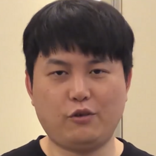

### 老菜

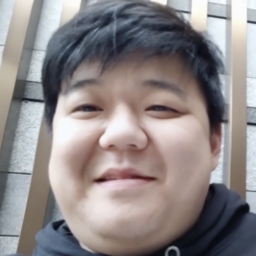

### 乌总

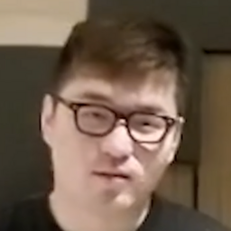

### 查理斯

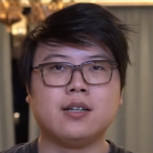

### 奶子D

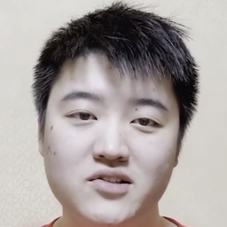

### 核桃

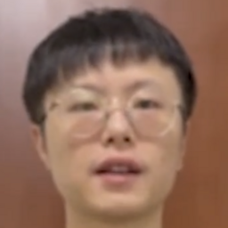

### 霸气

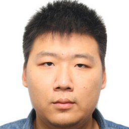

### 宝哥

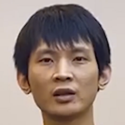

### 小明鞭

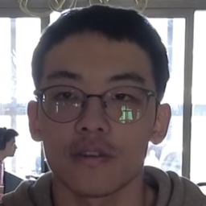

### 赵公子

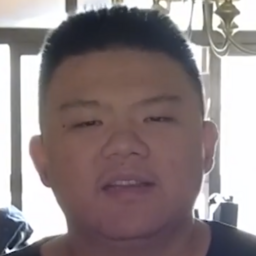

### 车长老

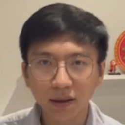

### 大木

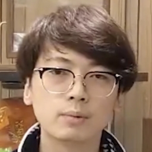

### 斗鸡

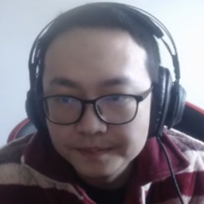

### 鲷哥

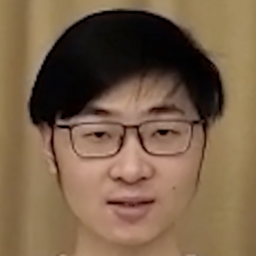

### 龙神

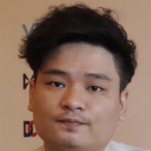

### 马甲

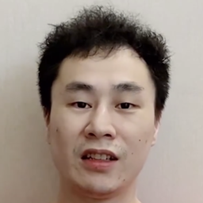

### 8师傅

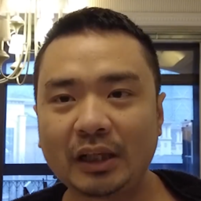

### 狗哥

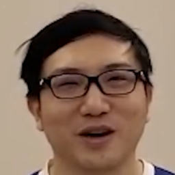
